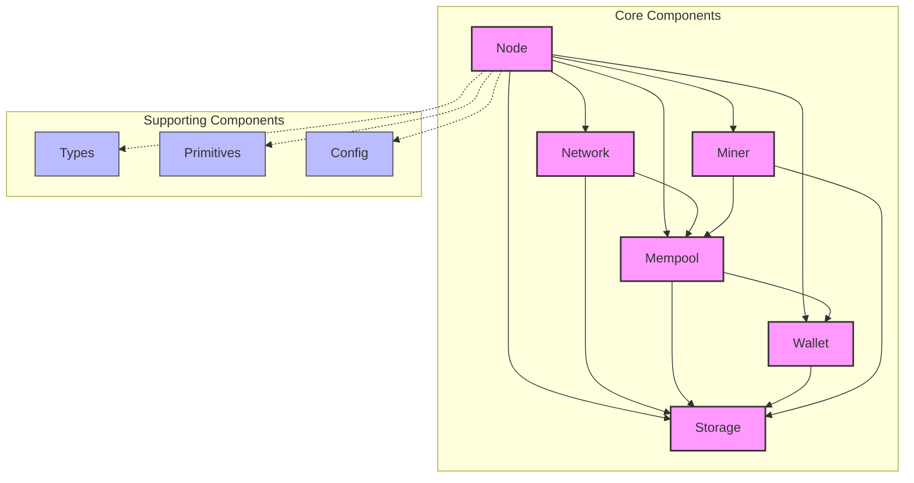

<div align="center">
    
    <h2>Bitcoin protocol implementation in Zig.</h2>

<a href="https://github.com/zig-bitcoin/btczee/actions/workflows/check.yml"></a>
<a href="https://ziglang.org/"> </a>
<a href="https://bitcoin.org/"> </a>
<a href="https://lightning.network/"></a>

</div>

# About

`btczee` is a Bitcoin protocol implementation in Zig. It aims to provide a clean and simple implementation of the Bitcoin protocol. The goal is to have a fully functional Bitcoin node that can be used to interact with the Bitcoin network.

## Architecture

You can find the architecture of the project and description of components in the [docs/architecture.md](./docs/architecture.md) file.



## Run

```sh
Usage: btczee [command] [args]

Commands:
  node     <subcommand>
  wallet   <subcommand>
```

### Node

```sh
Usage: btczee node <subcommand>

Subcommands:
  help   Display help for node
```

Example:

```sh
zig build run -- node

# OR (after a build)
./zig-out/bin/btczee node
```

### Wallet

```sh
Usage: btczee wallet <subcommand>

Subcommands:
  create    Create a new wallet
  load      Load an existing wallet
  help      Display help for wallet
```

Example:

```sh
zig build run -- wallet create

# OR (after a build)
./zig-out/bin/btczee wallet create
```

## Test

```sh
zig build test --summary all
```

## Build

```sh
zig build -Doptimize=ReleaseFast
```

## Benchmark

```sh
zig build bench
```

## Documentation

You can generate the documentation by running the following command:

```sh
zig build docs
```

## Roadmap

You can find the roadmap of the project in the [docs/roadmap.md](./docs/roadmap.md) file.

## License

`btczee` is licensed under the MIT license. See the [LICENSE](./LICENSE) file for more details.

## References

- [Bitcoin Core](https://github.com/bitcoin/bitcoin)
- [Learn me a bitcoin](https://learnmeabitcoin.com/)
- [Mastering Bitcoin](https://github.com/bitcoinbook/bitcoinbook)
- [Onboarding to Bitcoin Core](https://github.com/chaincodelabs/onboarding-to-bitcoin-core)
- [Zig](https://github.com/ziglang/zig)
- [Zig Standard Library](https://github.com/ziglang/zig/tree/master/lib/std)
- [Ziglings](https://codeberg.org/ziglings/exercises/)

## Contributors ✨

Thanks goes to these wonderful people ([emoji key](https://allcontributors.org/docs/en/emoji-key)):

<!-- ALL-CONTRIBUTORS-LIST:START - Do not remove or modify this section -->
<!-- prettier-ignore-start -->
<!-- markdownlint-disable -->
<table>
  <tbody>
    <tr>
      <td align="center" valign="top" width="14.28%"><a href="https://github.com/AbdelStark"><br /><sub><b>A₿del ∞/21M 🐺 - 🐱</b></sub></a><br /><a href="https://github.com/zig-bitcoin/btczee/commits?author=AbdelStark" title="Code">💻</a> <a href="#ideas-AbdelStark" title="Ideas, Planning, & Feedback">🤔</a> <a href="#mentoring-AbdelStark" title="Mentoring">🧑‍🏫</a> <a href="#projectManagement-AbdelStark" title="Project Management">📆</a> <a href="#research-AbdelStark" title="Research">🔬</a> <a href="https://github.com/zig-bitcoin/btczee/pulls?q=is%3Apr+reviewed-by%3AAbdelStark" title="Reviewed Pull Requests">👀</a></td>
      <td align="center" valign="top" width="14.28%"><a href="https://github.com/lana-shanghai"><br /><sub><b>lanaivina</b></sub></a><br /><a href="https://github.com/zig-bitcoin/btczee/commits?author=lana-shanghai" title="Code">💻</a></td>
      <td align="center" valign="top" width="14.28%"><a href="https://github.com/tdelabro"><br /><sub><b>Timothée Delabrouille</b></sub></a><br /><a href="https://github.com/zig-bitcoin/btczee/commits?author=tdelabro" title="Code">💻</a></td>
      <td align="center" valign="top" width="14.28%"><a href="https://okhaimie.com/"><br /><sub><b>okhai</b></sub></a><br /><a href="https://github.com/zig-bitcoin/btczee/commits?author=okhaimie-dev" title="Code">💻</a></td>
      <td align="center" valign="top" width="14.28%"><a href="https://github.com/supreme2580"><br /><sub><b>Supreme Labs</b></sub></a><br /><a href="https://github.com/zig-bitcoin/btczee/commits?author=supreme2580" title="Code">💻</a></td>
    </tr>
  </tbody>
  <tfoot>
    <tr>
      <td align="center" size="13px" colspan="7">
        
          <a href="https://all-contributors.js.org/docs/en/bot/usage">Add your contributions</a>
        </img>
      </td>
    </tr>
  </tfoot>
</table>

<!-- markdownlint-restore -->
<!-- prettier-ignore-end -->

<!-- ALL-CONTRIBUTORS-LIST:END -->

This project follows the [all-contributors](https://github.com/all-contributors/all-contributors) specification. Contributions of any kind welcome!
