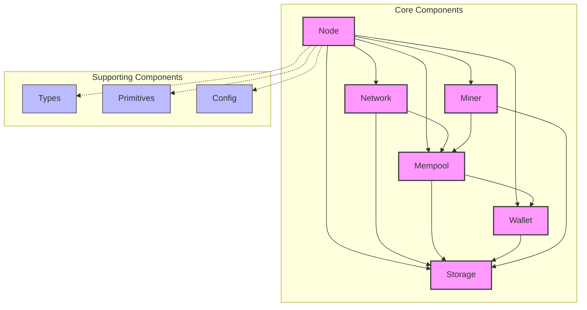
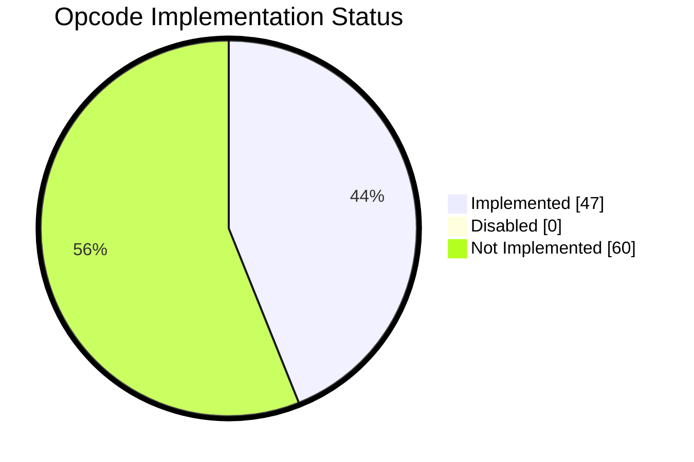

<div align="center">
    
    <h2>Bitcoin protocol implementation in Zig.</h2>

<a href="https://github.com/zig-bitcoin/btczee/actions/workflows/check.yml"></a>
<a href="https://ziglang.org/"> </a>
<a href="https://bitcoin.org/"> </a>
<a href="https://lightning.network/"></a>

</div>

# About

`btczee` is a Bitcoin protocol implementation in Zig. It aims to provide a clean and simple implementation of the Bitcoin protocol. The goal is to have a fully functional Bitcoin node that can be used to interact with the Bitcoin network.

## Architecture

You can find the architecture of the project and description of components in the [docs/architecture.md](./docs/architecture.md) file.



## Run

```sh
Usage: btczee [command] [args]

Commands:
  node     <subcommand>
  wallet   <subcommand>
```

### Node

```sh
Usage: btczee node <subcommand>

Subcommands:
  help   Display help for node
```

Example:

```sh
zig build run -- node

# OR (after a build)
./zig-out/bin/btczee node
```

### Wallet

```sh
Usage: btczee wallet <subcommand>

Subcommands:
  create    Create a new wallet
  load      Load an existing wallet
  help      Display help for wallet
```

Example:

```sh
zig build run -- wallet create

# OR (after a build)
./zig-out/bin/btczee wallet create
```

## Test

```sh
zig build test --summary all
```

## Build

```sh
zig build -Doptimize=ReleaseFast
```

## Benchmark

```sh
zig build bench
```

## Documentation

You can generate the documentation by running the following command:

```sh
zig build docs
```

## Roadmap

You can find the roadmap of the project in the [docs/roadmap.md](./docs/roadmap.md) file.

## License

`btczee` is licensed under the MIT license. See the [LICENSE](./LICENSE) file for more details.

## References

- [Bitcoin Core](https://github.com/bitcoin/bitcoin)
- [Learn me a bitcoin](https://learnmeabitcoin.com/)
- [Mastering Bitcoin](https://github.com/bitcoinbook/bitcoinbook)
- [Onboarding to Bitcoin Core](https://github.com/chaincodelabs/onboarding-to-bitcoin-core)
- [Zig](https://github.com/ziglang/zig)
- [Zig Standard Library](https://github.com/ziglang/zig/tree/master/lib/std)
- [Ziglings](https://codeberg.org/ziglings/exercises/)

## Acknowledgements

- [Syndica sig client in Zig](https://github.com/Syndica/sig), we are using a copy of their `time` and `trace` modules. Right now, they are not usable as external dependencies, we hope it will be possible in the future, and if so, we will switch to using their libraries directly.

## Supported Opcodes

47/107 opcodes supported (43.92%).



| Opcode                 | Hex       | Supported | Description                                                                                                                                                                                                                                                                                                                                                                                                                                                                                                                        |
| ---------------------- | --------- | :-------: | ---------------------------------------------------------------------------------------------------------------------------------------------------------------------------------------------------------------------------------------------------------------------------------------------------------------------------------------------------------------------------------------------------------------------------------------------------------------------------------------------------------------------------------- |
| op0 / opFalse        | 0x00      |     ❌     | An empty array of bytes is pushed onto the stack.                                                                                                                                                                                                                                                                                                                                                                                                                                                                                  |
| opData1-opData75   | 0x01-0x4b |     ❌     | The next opcode bytes is data to be pushed onto the stack.                                                                                                                                                                                                                                                                                                                                                                                                                                                            |
| opPushData1           | 0x4c      |     ✅     | The next byte contains the number of bytes to be pushed onto the stack.                                                                                                                                                                                                                                                                                                                                                                                                                                                            |
| opPushData2           | 0x4d      |     ✅     | The next two bytes contain the number of bytes to be pushed onto the stack in little endian order.                                                                                                                                                                                                                                                                                                                                                                                                                                 |
| opPushData4           | 0x4e      |     ✅     | The next four bytes contain the number of bytes to be pushed onto the stack in little endian order.                                                                                                                                                                                                                                                                                                                                                                                                                                |
| op1Negate             | 0x4f      |     ✅     | The number -1 is pushed onto the stack.                                                                                                                                                                                                                                                                                                                                                                                                                                                                                            |
| opReserved            | 0x50      |     ❌     | Transaction is invalid unless occurring in an unexecuted opIF branch                                                                                                                                                                                                                                                                                                                                                                                                                                                              |
| op1 / opTrue         | 0x51      |     ✅     | The number 1 is pushed onto the stack.                                                                                                                                                                                                                                                                                                                                                                                                                                                                                             |
| op2                   | 0x52      |     ✅     | The number 2 is pushed onto the stack.                                                                                                                                                                                                                                                                                                                                                                                                                                                                                             |
| op3                   | 0x53      |     ✅     | The number 3 is pushed onto the stack.                                                                                                                                                                                                                                                                                                                                                                                                                                                                                             |
| op4                   | 0x54      |     ✅     | The number 4 is pushed onto the stack.                                                                                                                                                                                                                                                                                                                                                                                                                                                                                             |
| op5                   | 0x55      |     ✅     | The number 5 is pushed onto the stack.                                                                                                                                                                                                                                                                                                                                                                                                                                                                                             |
| op6                   | 0x56      |     ✅     | The number 6 is pushed onto the stack.                                                                                                                                                                                                                                                                                                                                                                                                                                                                                             |
| op7                   | 0x57      |     ✅     | The number 7 is pushed onto the stack.                                                                                                                                                                                                                                                                                                                                                                                                                                                                                             |
| op8                   | 0x58      |     ✅     | The number 8 is pushed onto the stack.                                                                                                                                                                                                                                                                                                                                                                                                                                                                                             |
| op9                   | 0x59      |     ✅     | The number 9 is pushed onto the stack.                                                                                                                                                                                                                                                                                                                                                                                                                                                                                             |
| op10                  | 0x5a      |     ✅     | The number 10 is pushed onto the stack.                                                                                                                                                                                                                                                                                                                                                                                                                                                                                            |
| op11                  | 0x5b      |     ✅     | The number 11 is pushed onto the stack.                                                                                                                                                                                                                                                                                                                                                                                                                                                                                            |
| op12                  | 0x5c      |     ✅     | The number 12 is pushed onto the stack.                                                                                                                                                                                                                                                                                                                                                                                                                                                                                            |
| op13                  | 0x5d      |     ✅     | The number 13 is pushed onto the stack.                                                                                                                                                                                                                                                                                                                                                                                                                                                                                            |
| op14                  | 0x5e      |     ✅     | The number 14 is pushed onto the stack.                                                                                                                                                                                                                                                                                                                                                                                                                                                                                            |
| op15                  | 0x5f      |     ✅     | The number 15 is pushed onto the stack.                                                                                                                                                                                                                                                                                                                                                                                                                                                                                            |
| op16                  | 0x60      |     ✅     | The number 16 is pushed onto the stack.                                                                                                                                                                                                                                                                                                                                                                                                                                                                                            |
| opNop                 | 0x61      |     ✅     | Does nothing.                                                                                                                                                                                                                                                                                                                                                                                                                                                                                                                      |
| opVer                 | 0x62      |     ❌     | Transaction is invalid unless occurring in an unexecuted opIF branch                                                                                                                                                                                                                                                                                                                                                                                                                                                              |
| opIf                  | 0x63      |     ❌     | If the top stack value is not False, the statements are executed. The top stack value is removed.                                                                                                                                                                                                                                                                                                                                                                                                                                  |
| opNotIf               | 0x64      |     ❌     | If the top stack value is False, the statements are executed. The top stack value is removed.                                                                                                                                                                                                                                                                                                                                                                                                                                      |
| opVerIf               | 0x65      |     ❌     | Transaction is invalid even when occurring in an unexecuted opIF branch                                                                                                                                                                                                                                                                                                                                                                                                                                                           |
| opVerNotIf            | 0x66      |     ❌     | Transaction is invalid even when occurring in an unexecuted opIF branch                                                                                                                                                                                                                                                                                                                                                                                                                                                           |
| opElse                | 0x67      |     ❌     | If the preceding opIF or opNOTIF or opELSE was not executed then these statements are and if the preceding opIF or opNOTIF or opELSE was executed then these statements are not.                                                                                                                                                                                                                                                                                                                                             |
| opEndIf               | 0x68      |     ❌     | Ends an if/else block.                                                                                                                                                                                                                                                                                                                                                                                                                                                                                                             |
| opVerify              | 0x69      |     ✅     | Marks transaction as invalid if top stack value is not true.                                                                                                                                                                                                                                                                                                                                                                                                                                                                       |
| opReturn              | 0x6a      |     ✅     | Marks transaction as invalid.                                                                                                                                                                                                                                                                                                                                                                                                                                                                                                      |
| opToAltStack          | 0x6b      |     ✅     | Puts the input onto the top of the alt stack. Removes it from the main stack.                                                                                                                                                                                                                                                                                                                                                                                                                                                      |
| opFromAltStack        | 0x6c      |     ✅     | Puts the input onto the top of the main stack. Removes it from the alt stack.                                                                                                                                                                                                                                                                                                                                                                                                                                                      |
| op2Drop               | 0x6d      |     ✅     | Removes the top two stack items.                                                                                                                                                                                                                                                                                                                                                                                                                                                                                                   |
| op2Dup                | 0x6e      |     ✅     | Duplicates the top two stack items.                                                                                                                                                                                                                                                                                                                                                                                                                                                                                                |
| op3Dup                | 0x6f      |     ✅     | Duplicates the top three stack items.                                                                                                                                                                                                                                                                                                                                                                                                                                                                                              |
| op2Over               | 0x70      |     ✅     | Copies the pair of items two spaces back in the stack to the front.                                                                                                                                                                                                                                                                                                                                                                                                                                                                |
| op2Rot                | 0x71      |     ✅     | The fifth and sixth items back are moved to the top of the stack.                                                                                                                                                                                                                                                                                                                                                                                                                                                                  |
| op2Swap               | 0x72      |     ✅     | Swaps the top two pairs of items.                                                                                                                                                                                                                                                                                                                                                                                                                                                                                                  |
| opIfDup               | 0x73      |     ✅     | If the top stack value is not 0, duplicate it.                                                                                                                                                                                                                                                                                                                                                                                                                                                                                     |
| opDepth               | 0x74      |     ✅     | Puts the number of stack items onto the stack.                                                                                                                                                                                                                                                                                                                                                                                                                                                                                     |
| opDrop                | 0x75      |     ✅     | Removes the top stack item.                                                                                                                                                                                                                                                                                                                                                                                                                                                                                                        |
| opDup                 | 0x76      |     ✅     | Duplicates the top stack item.                                                                                                                                                                                                                                                                                                                                                                                                                                                                                                     |
| opNip                 | 0x77      |     ✅     | Removes the second-to-top stack item.                                                                                                                                                                                                                                                                                                                                                                                                                                                                                              |
| opOver                | 0x78      |     ✅     | Copies the second-to-top stack item to the top.                                                                                                                                                                                                                                                                                                                                                                                                                                                                                    |
| opPick                | 0x79      |     ✅     | The item n back in the stack is copied to the top.                                                                                                                                                                                                                                                                                                                                                                                                                                                                                 |
| opRoll                | 0x7a      |     ✅     | The item n back in the stack is moved to the top.                                                                                                                                                                                                                                                                                                                                                                                                                                                                                  |
| opRot                 | 0x7b      |     ✅     | The top three items on the stack are rotated to the left.                                                                                                                                                                                                                                                                                                                                                                                                                                                                          |
| opSwap                | 0x7c      |     ✅     | The top two items on the stack are swapped.                                                                                                                                                                                                                                                                                                                                                                                                                                                                                        |
| opTuck                | 0x7d      |     ✅     | The item at the top of the stack is copied and inserted before the second-to-top item.                                                                                                                                                                                                                                                                                                                                                                                                                                             |
| opCat                 | 0x7e      |     ❗     | Concatenates two strings. Disabled.                                                                                                                                                                                                                                                                                                                                                                                                                                                                                                |
| opSubStr              | 0x7f      |     ❗     | Returns a section of a string. Disabled.                                                                                                                                                                                                                                                                                                                                                                                                                                                                                           |
| opLeft                | 0x80      |     ❗     | Keeps only characters left of the specified point in a string. Disabled.                                                                                                                                                                                                                                                                                                                                                                                                                                                           |
| opRight               | 0x81      |     ❗     | Keeps only characters right of the specified point in a string. Disabled.                                                                                                                                                                                                                                                                                                                                                                                                                                                          |
| opSize                | 0x82      |     ✅     | Pushes the string length of the top element of the stack (without popping it).                                                                                                                                                                                                                                                                                                                                                                                                                                                     |
| opInvert              | 0x83      |     ❗     | Flips all of the bits in the input. Disabled.                                                                                                                                                                                                                                                                                                                                                                                                                                                                                      |
| opAnd                 | 0x84      |     ❗     | Boolean and between each bit in the inputs. Disabled.                                                                                                                                                                                                                                                                                                                                                                                                                                                                              |
| opOr                  | 0x85      |     ❗     | Boolean or between each bit in the inputs. Disabled.                                                                                                                                                                                                                                                                                                                                                                                                                                                                               |
| opXor                 | 0x86      |     ❗     | Boolean exclusive or between each bit in the inputs. Disabled.                                                                                                                                                                                                                                                                                                                                                                                                                                                                     |
| opEqual               | 0x87      |     ✅     | Returns 1 if the inputs are exactly equal, 0 otherwise.                                                                                                                                                                                                                                                                                                                                                                                                                                                                            |
| opEqualVerify         | 0x88      |     ✅     | Same as opEQUAL, but runs opVERIFY afterward.                                                                                                                                                                                                                                                                                                                                                                                                                                                                                    |
| opReserved1           | 0x89      |     ❌     | Transaction is invalid unless occurring in an unexecuted opIF branch                                                                                                                                                                                                                                                                                                                                                                                                                                                              |
| opReserved2           | 0x8a      |     ❌     | Transaction is invalid unless occurring in an unexecuted opIF branch                                                                                                                                                                                                                                                                                                                                                                                                                                                              |
| op1Add                | 0x8b      |     ✅     | 1 is added to the input.                                                                                                                                                                                                                                                                                                                                                                                                                                                                                                           |
| op1Sub                | 0x8c      |     ✅     | 1 is subtracted from the input.                                                                                                                                                                                                                                                                                                                                                                                                                                                                                                    |
| op2Mul                | 0x8d      |     ❗     | The input is multiplied by 2. Disabled.                                                                                                                                                                                                                                                                                                                                                                                                                                                                                            |
| op2Div                | 0x8e      |     ❗     | The input is divided by 2. Disabled.                                                                                                                                                                                                                                                                                                                                                                                                                                                                                               |
| opNegate              | 0x8f      |     ✅     | The sign of the input is flipped.                                                                                                                                                                                                                                                                                                                                                                                                                                                                                                  |
| opAbs                 | 0x90      |     ✅     | The input is made positive.                                                                                                                                                                                                                                                                                                                                                                                                                                                                                                        |
| opNot                 | 0x91      |     ✅     | If the input is 0 or 1, it is flipped. Otherwise the output will be 0.                                                                                                                                                                                                                                                                                                                                                                                                                                                             |
| op0NotEqual           | 0x92      |     ✅     | Returns 0 if the input is 0. 1 otherwise.                                                                                                                                                                                                                                                                                                                                                                                                                                                                                          |
| opAdd                 | 0x93      |     ✅     | a is added to b.                                                                                                                                                                                                                                                                                                                                                                                                                                                                                                                   |
| opSub                 | 0x94      |     ✅     | b is subtracted from a.                                                                                                                                                                                                                                                                                                                                                                                                                                                                                                            |
| opMul                 | 0x95      |     ❗     | a is multiplied by b. Disabled.                                                                                                                                                                                                                                                                                                                                                                                                                                                                                                    |
| opDiv                 | 0x96      |     ❗     | a is divided by b. Disabled.                                                                                                                                                                                                                                                                                                                                                                                                                                                                                                       |
| opMod                 | 0x97      |     ❗     | Returns the remainder after dividing a by b. Disabled.                                                                                                                                                                                                                                                                                                                                                                                                                                                                             |
| opLShift              | 0x98      |     ❗     | Shifts a left b bits, preserving sign. Disabled.                                                                                                                                                                                                                                                                                                                                                                                                                                                                                   |
| opRShift              | 0x99      |     ❗     | Shifts a right b bits, preserving sign. Disabled.                                                                                                                                                                                                                                                                                                                                                                                                                                                                                  |
| opBoolAnd             | 0x9a      |     ✅     | If both a and b are not 0, the output is 1. Otherwise 0.                                                                                                                                                                                                                                                                                                                                                                                                                                                                           |
| opBoolOr              | 0x9b      |     ✅     | If a or b is not 0, the output is 1. Otherwise 0.                                                                                                                                                                                                                                                                                                                                                                                                                                                                                  |
| opNumEqual            | 0x9c      |     ✅     | Returns 1 if the numbers are equal, 0 otherwise.                                                                                                                                                                                                                                                                                                                                                                                                                                                                                   |
| opNumEqualVerify      | 0x9d      |     ✅     | Same as opNUMEQUAL, but runs opVERIFY afterward.                                                                                                                                                                                                                                                                                                                                                                                                                                                                                 |
| opNumNorEqual         | 0x9e      |     ✅     | Returns 1 if the numbers are not equal, 0 otherwise.                                                                                                                                                                                                                                                                                                                                                                                                                                                                               |
| opLessThan            | 0x9f      |     ✅     | Returns 1 if a is less than b, 0 otherwise.                                                                                                                                                                                                                                                                                                                                                                                                                                                                                        |
| opGreaterThan         | 0xa0      |     ✅     | Returns 1 if a is greater than b, 0 otherwise.                                                                                                                                                                                                                                                                                                                                                                                                                                                                                     |
| opLessThanOrEqual     | 0xa1      |     ✅     | Returns 1 if a is less than or equal to b, 0 otherwise.                                                                                                                                                                                                                                                                                                                                                                                                                                                                            |
| opGreaterThanOrEqual  | 0xa2      |     ✅     | Returns 1 if a is greater than or equal to b, 0 otherwise.                                                                                                                                                                                                                                                                                                                                                                                                                                                                         |
| opMin                 | 0xa3      |     ✅     | Returns the smaller of a and b.                                                                                                                                                                                                                                                                                                                                                                                                                                                                                                    |
| opMax                 | 0xa4      |     ✅     | Returns the larger of a and b.                                                                                                                                                                                                                                                                                                                                                                                                                                                                                                     |
| opWithin             | 0xa5      |     ✅     | Returns 1 if x is within the specified range (left-inclusive), 0 otherwise.                                                                                                                                                                                                                                                                                                                                                                                                                                                        |
| opRipeMd160           | 0xa6      |     ✅     | The input is hashed using RIPEMD-160.                                                                                                                                                                                                                                                                                                                                                                                                                                                                                              |
| opSha1                | 0xa7      |     ✅     | The input is hashed using SHA-1.                                                                                                                                                                                                                                                                                                                                                                                                                                                                                                   |
| opSha256              | 0xa8      |     ✅     | The input is hashed using SHA-256.                                                                                                                                                                                                                                                                                                                                                                                                                                                                                                 |
| opHash160             | 0xa9      |     ✅     | The input is hashed twice: first with SHA-256 and then with RIPEMD-160.                                                                                                                                                                                                                                                                                                                                                                                                                                                            |
| opHash256             | 0xaa      |     ❌     | The input is hashed two times with SHA-256.                                                                                                                                                                                                                                                                                                                                                                                                                                                                                        |
| opCodeSeparator       | 0xab      |     ❌     | All of the signature checking words will only match signatures to the data after the most recently-executed opCODESEPARATOR.                                                                                                                                                                                                                                                                                                                                                                                                      |
| opCheckSig            | 0xac      |     ✅     | The entire transaction's outputs, inputs, and script are hashed. The signature used by opCHECKSIG must be a valid signature for this hash and public key. If it is, 1 is returned, 0 otherwise.                                                                                                                                                                                                                                                                                                                                   |
| opCheckSigVerify      | 0xad      |     ❌     | Same as opCHECKSIG, but opVERIFY is executed afterward.                                                                                                                                                                                                                                                                                                                                                                                                                                                                          |
| opCheckMultiSig       | 0xae      |     ❌     | Compares the first signature against each public key until it finds an ECDSA match. Starting with the subsequent public key, it compares the second signature against each remaining public key until it finds an ECDSA match. The process is repeated until all signatures have been checked or not enough public keys remain to produce a successful result. All signatures need to match a public key. If all signatures are valid, 1 is returned, 0 otherwise. Due to a bug, one extra unused value is removed from the stack. |
| opCheckMultiSigVerify | 0xaf      |     ❌     | Same as opCHECKMULTISIG, but opVERIFY is executed afterward.                                                                                                                                                                                                                                                                                                                                                                                                                                                                     |
| opNop1                | 0xb0      |     ❌     | The word is ignored. Does not mark transaction as invalid.                                                                                                                                                                                                                                                                                                                                                                                                                                                                         |
| opCheckLockTimeVerify | 0xb1      |     ❌     | Marks transaction as invalid if the top stack item is greater than the transaction's nLockTime field, otherwise script evaluation continues as though an opNOP was executed.                                                                                                                                                                                                                                                                                                                                                      |
| opCheckSequenceVerify | 0xb2      |     ❌     | Marks transaction as invalid if the relative lock time of the input is not equal to or longer than the value of the top stack item.                                                                                                                                                                                                                                                                                                                                                                                                |
| opNop4-opNop10       | 0xb3-0xb9 |     ❌     | The word is ignored. Does not mark transaction as invalid.                                                                                                                                                                                                                                                                                                                                                                                                                                                                         |
| opCheckSigAdd         | 0xba      |           | Increments n by one and returns to the stack if the signature is valid for the public key and transaction. Only available in tapscript.

## Contributors ✨

Thanks goes to these wonderful people ([emoji key](https://allcontributors.org/docs/en/emoji-key)):

<!-- ALL-CONTRIBUTORS-LIST:START - Do not remove or modify this section -->
<!-- prettier-ignore-start -->
<!-- markdownlint-disable -->
<table>
  <tbody>
    <tr>
      <td align="center" valign="top" width="14.28%"><a href="https://github.com/AbdelStark"><br /><sub><b>A₿del ∞/21M 🐺 - 🐱</b></sub></a><br /><a href="https://github.com/zig-bitcoin/btczee/commits?author=AbdelStark" title="Code">💻</a> <a href="#ideas-AbdelStark" title="Ideas, Planning, & Feedback">🤔</a> <a href="#mentoring-AbdelStark" title="Mentoring">🧑‍🏫</a> <a href="#projectManagement-AbdelStark" title="Project Management">📆</a> <a href="#research-AbdelStark" title="Research">🔬</a> <a href="https://github.com/zig-bitcoin/btczee/pulls?q=is%3Apr+reviewed-by%3AAbdelStark" title="Reviewed Pull Requests">👀</a></td>
      <td align="center" valign="top" width="14.28%"><a href="https://github.com/lana-shanghai"><br /><sub><b>lanaivina</b></sub></a><br /><a href="https://github.com/zig-bitcoin/btczee/commits?author=lana-shanghai" title="Code">💻</a></td>
      <td align="center" valign="top" width="14.28%"><a href="https://github.com/tdelabro"><br /><sub><b>Timothée Delabrouille</b></sub></a><br /><a href="https://github.com/zig-bitcoin/btczee/commits?author=tdelabro" title="Code">💻</a></td>
      <td align="center" valign="top" width="14.28%"><a href="https://okhaimie.com/"><br /><sub><b>okhai</b></sub></a><br /><a href="https://github.com/zig-bitcoin/btczee/commits?author=okhaimie-dev" title="Code">💻</a></td>
      <td align="center" valign="top" width="14.28%"><a href="https://github.com/supreme2580"><br /><sub><b>Supreme Labs</b></sub></a><br /><a href="https://github.com/zig-bitcoin/btczee/commits?author=supreme2580" title="Code">💻</a></td>
      <td align="center" valign="top" width="14.28%"><a href="https://varun-doshi.vercel.app/"><br /><sub><b>Varun Doshi</b></sub></a><br /><a href="https://github.com/zig-bitcoin/btczee/commits?author=varun-doshi" title="Code">💻</a></td>
    </tr>
  </tbody>
  <tfoot>
    <tr>
      <td align="center" size="13px" colspan="7">
        
          <a href="https://all-contributors.js.org/docs/en/bot/usage">Add your contributions</a>
        </img>
      </td>
    </tr>
  </tfoot>
</table>

<!-- markdownlint-restore -->
<!-- prettier-ignore-end -->

<!-- ALL-CONTRIBUTORS-LIST:END -->

This project follows the [all-contributors](https://github.com/all-contributors/all-contributors) specification. Contributions of any kind welcome!
