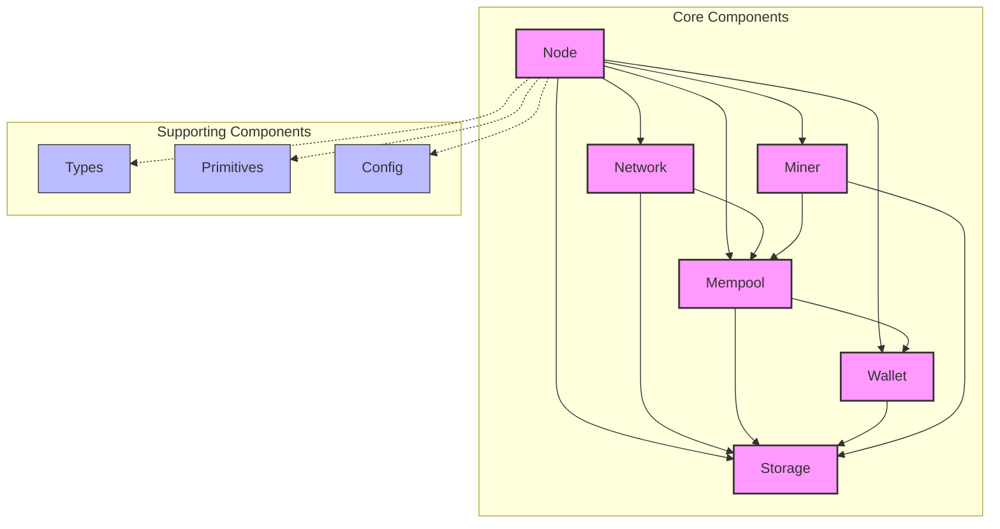

# btczee Architecture

This document describes the high-level architecture of btczee, a Bitcoin implementation in Zig. The project is structured into several key components, each responsible for specific functionality within the Bitcoin protocol.

## Components

### 1. Node

**Location**: `src/node/node.zig`

The Node component is the central coordination point for the Bitcoin node. It initializes and manages other components, handles the node's lifecycle, and coordinates communication between different parts of the system.

### 2. Network

**Location**: `src/network/`

The Network component handles all peer-to-peer communication within the Bitcoin network, as well as the RPC interface for interacting with the node. It's divided into several subcomponents:

- `p2p.zig`: Manages the P2P network layer
- `peer.zig`: Handles individual peer connections
- `protocol.zig`: Implements the Bitcoin network protocol
- `rpc.zig`: Provides an RPC interface for interacting with the node

### 3. Mempool

**Location**: `src/core/mempool.zig`

The Mempool component manages the node's memory pool of unconfirmed transactions. It handles transaction validation, fee estimation, and transaction selection for block creation (if mining is enabled).

### 4. Wallet

**Location**: `src/wallet/wallet.zig`

The Wallet component manages the user's Bitcoin wallet, including key management, transaction creation and signing, and balance tracking.

### 5. Storage

**Location**: `src/storage/storage.zig`

The Storage component handles persistent storage of blockchain data, including blocks, transactions, and the UTXO set.

### 6. Miner

**Location**: `src/miner/miner.zig`

The Miner component implements Bitcoin mining functionality, including block template creation and Proof-of-Work calculation.

### 7. Types

**Location**: `src/types/`

The Types component defines core Bitcoin data structures:

- `block.zig`: Defines the Block structure
- `transaction.zig`: Defines the Transaction structure

### 8. Primitives

**Location**: `src/primitives/lib.zig`

The Primitives component provides low-level Bitcoin primitives and utilities used throughout the codebase.

### 9. Config

**Location**: `src/config/config.zig`

The Config component manages node configuration and settings.

## Component Interactions

The following diagram illustrates the high-level interactions between components:

## Interaction Descriptions

1. **Node and Network**: The Node initializes the Network component, which handles all incoming and outgoing network communication. The Network component notifies the Node of new blocks and transactions.
2. **Node and Mempool**: The Node uses the Mempool to validate and store unconfirmed transactions. The Mempool notifies the Node of changes in the transaction pool.
3. **Node and Wallet**: The Node interacts with the Wallet for transaction creation and signing. The Wallet notifies the Node of new transactions that need to be broadcast.
4. **Node and Storage**: The Node uses the Storage component to persist and retrieve blockchain data, including blocks and the UTXO set.
5. **Node and Miner**: The Node coordinates with the Miner for block creation and Proof-of-Work calculation.
6. **Network and Mempool**: The Network component passes new transactions to the Mempool for validation and storage.
7. **Network and Storage**: The Network component retrieves block and transaction data from Storage for peer requests.
8. **Mempool and Wallet**: The Mempool interacts with the Wallet to validate transactions and check for double-spends.
   Mempool and Storage: The Mempool uses Storage to persist the mempool state and check against the UTXO set.
9. **Wallet and Storage**: The Wallet uses Storage to persist wallet data and retrieve historical transaction information.
10. **Miner and Mempool**: The Miner requests transactions from the Mempool for block creation.
11. **Miner and Storage**: The Miner interacts with Storage to retrieve necessary data for block creation and to store newly mined blocks.
